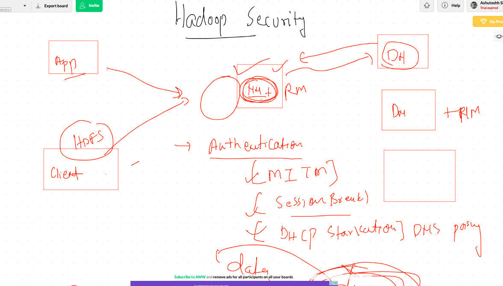
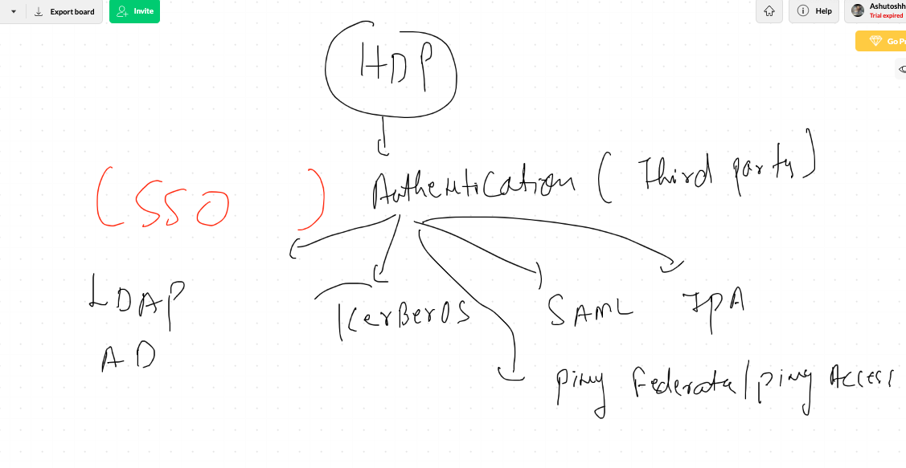
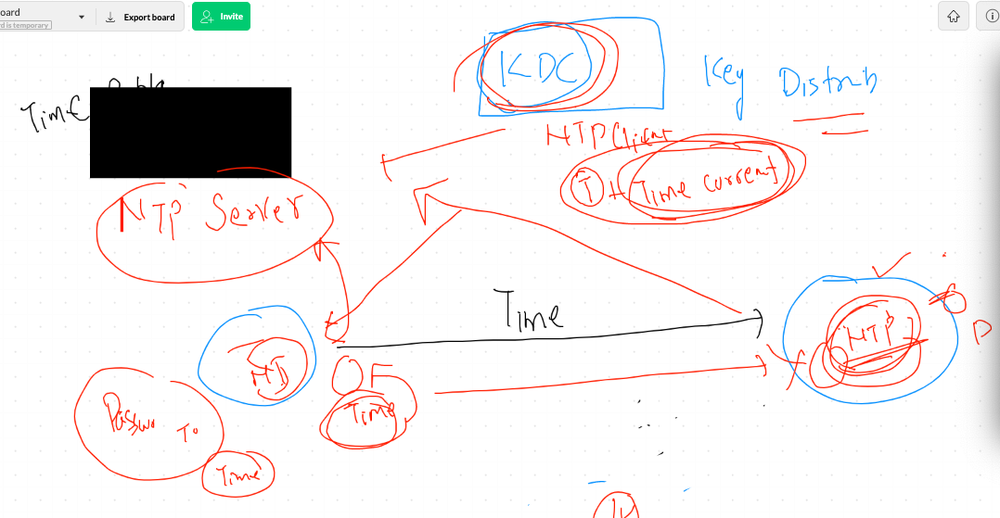
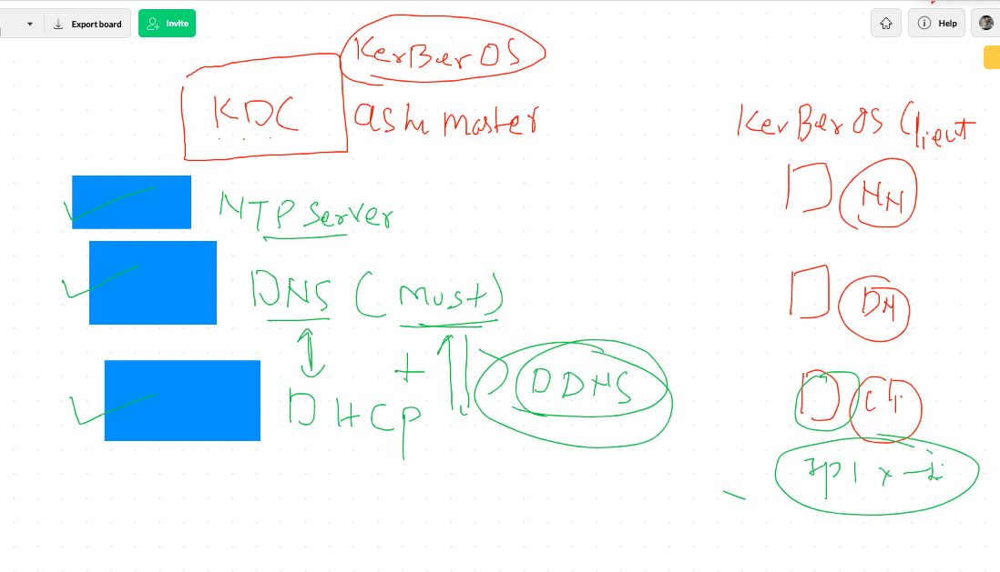

# HDP  Backend Understanding 

# agenda sharing 


## checking rpm packages installed by ambari 

```
[root@ashumaster ~]# rpm  -qa  ambari* 
ambari-agent-2.6.2.2-1.x86_64
ambari-metrics-hadoop-sink-2.6.2.2-1.x86_64
ambari-server-2.6.2.2-1.x86_64
ambari-infra-solr-client-2.6.2.2-1.noarch
ambari-metrics-monitor-2.6.2.2-1.x86_64
[root@ashumaster ~]# rpm  -qa  |  grep -i hadoop
hadoop_2_6_5_1175_1-yarn-2.7.3.2.6.5.1175-1.x86_64
hadoop_2_6_5_1175_1-client-2.7.3.2.6.5.1175-1.x86_64
ambari-metrics-hadoop-sink-2.6.2.2-1.x86_64
hadoop_2_6_5_1175_1-2.7.3.2.6.5.1175-1.x86_64
hadoop_2_6_5_1175_1-mapreduce-2.7.3.2.6.5.1175-1.x86_64
hadoop_2_6_5_1175_1-hdfs-2.7.3.2.6.5.1175-1.x86_64
hadoop_2_6_5_1175_1-libhdfs-2.7.3.2.6.5.1175-1.x86_64
[root@ashumaster ~]# rpm  -ql hadoop_2_6_5_1175_1-hdfs
/usr/hdp/2.6.5.1175-1/etc/hadoop/conf.empty/hdfs-site.xml
/usr/hdp/2.6.5.1175-1/etc/security/limits.d/hdfs.conf
/usr/hdp/2.6.5.1175-1/hadoop-hdfs
/usr/hdp/2.6.5.1175-1/hadoop-hdfs/bin
/usr/hdp/2.6.5.1175-1/hadoop-hdfs/bin/hdfs

```
## checking HDFS backend done by ambari agent 

```
[root@ashumaster ~]# cd  /etc/hadoop/
2.6.5.1175-1/ conf/         conf.backup/  
[root@ashumaster ~]# cd  /etc/hadoop/
[root@ashumaster hadoop]# ls
2.6.5.1175-1  conf  conf.backup
[root@ashumaster hadoop]# cd  2.6.5.1175-1/
[root@ashumaster 2.6.5.1175-1]# ls
0
[root@ashumaster 2.6.5.1175-1]# cd  0/
[root@ashumaster 0]# ls
capacity-scheduler.xml      kms-acls.xml                ssl-client.xml.example
commons-logging.properties  kms-env.sh                  ssl-server.xml
configuration.xsl           kms-log4j.properties        ssl-server.xml.example
container-executor.cfg      kms-site.xml                task-log4j.properties
core-site.xml               log4j.properties            taskcontroller.cfg
dfs.exclude                 mapred-env.cmd              topology_mappings.data
hadoop-env.cmd              mapred-env.sh               topology_script.py
hadoop-env.sh               mapred-queues.xml.template  yarn-env.cmd
hadoop-metrics.properties   mapred-site.xml             yarn-env.sh
hadoop-metrics2.properties  mapred-site.xml.template    yarn-site.xml
hadoop-policy.xml           secure                      yarn.exclude
hdfs-site.xml               slaves
health_check                ssl-client.xml

```

## details about logs  for Hadoop services 

### Hadoop framework can generate logs but can't manage it so Default linux server will its log daemon like rsyslog / fluentd / ELK  / EFK 

## In our case we have rsyslog in centos / rhel / OL 7 

```
[root@ashumaster hdfs]# cd  /var/log/
[root@ashumaster log]# ls
ambari-agent              boot.log-20200915  dmesg.old           hive           maillog-20200915   secure-20200915     yum.log
ambari-infra-solr-client  btmp               grubby              hive-hcatalog  mariadb            spooler             yum.log-20200915
ambari-metrics-monitor    btmp-20200915      grubby_prune_debug  hive2          messages           spooler-20200915    zookeeper
ambari-server             cloud-init.log     hadoop              hst            messages-20200915  tallylog
anaconda                  cron               hadoop-hdfs         httpd          ntpstats           tuned
audit                     cron-20200915      hadoop-mapreduce    lastlog        ppp                wpa_supplicant.log
boot.log                  dmesg              hadoop-yarn         maillog        secure             wtmp
[root@ashumaster log]# cd  hadoop
[root@ashumaster hadoop]# ls
hdfs
[root@ashumaster hadoop]# cd  hdfs/
[root@ashumaster hdfs]# ls
SecurityAuth.audit   hadoop-hdfs-journalnode-ashumaster.hadoop.com.log    hadoop-hdfs-namenode-ashumaster.hadoop.com.out.3
gc.log-202009150204  hadoop-hdfs-journalnode-ashumaster.hadoop.com.out    hadoop-hdfs-namenode-ashumaster.hadoop.com.out.4
gc.log-202009150230  hadoop-hdfs-journalnode-ashumaster.hadoop.com.out.1  hadoop-hdfs-namenode-ashumaster.hadoop.com.out.5
gc.log-202009150511  hadoop-hdfs-journalnode-ashumaster.hadoop.com.out.2  hadoop-hdfs-zkfc-ashumaster.hadoop.com.log
gc.log-202009150512  hadoop-hdfs-journalnode-ashumaster.hadoop.com.out.3  hadoop-hdfs-zkfc-ashumaster.hadoop.com.out
gc.log-202009150523  hadoop-hdfs-namenode-ashumaster.hadoop.com.log       hadoop-hdfs-zkfc-ashumaster.hadoop.com.out.1
gc.log-202009150800  hadoop-hdfs-namenode-ashumaster.hadoop.com.out       hadoop-hdfs-zkfc-ashumaster.hadoop.com.out.2
gc.log-202009152206  hadoop-hdfs-namenode-ashumaster.hadoop.com.out.1     hadoop-hdfs-zkfc-ashumaster.hadoop.com.out.3
gc.log-202009152312  hadoop-hdfs-namenode-ashumaster.hadoop.com.out.2     hdfs-audit.log
[root@ashumaster hdfs]# vim  /etc/rsyslog.conf 

```

# Hadoop Security  

# auth with Kerberos 



## example of auth method



## kdc connection 



## setup prerequisite 



## setting up Kerberos Server 

```
161  yum install  krb5-workstation  krb5-libs  krb5-server  -y

```

## checking configuration 

```
[root@ashumaster ~]# rpm  -q krb5-server
krb5-server-1.15.1-46.el7.x86_64
[root@ashumaster ~]# rpm  -qc krb5-server
/etc/logrotate.d/kadmind
/etc/logrotate.d/krb5kdc
/etc/sysconfig/kadmin
/etc/sysconfig/kprop
/etc/sysconfig/krb5kdc
/var/kerberos/krb5kdc/kadm5.acl
/var/kerberos/krb5kdc/kdc.conf
[root@ashumaster ~]# 
[root@ashumaster ~]# rpm -qf   /etc/krb5.conf 
krb5-libs-1.15.1-46.el7.x86_64
[root@ashumaster ~]# 


==
[root@ashumaster ~]# cat /etc/krb5.conf
# Configuration snippets may be placed in this directory as well
includedir /etc/krb5.conf.d/

[logging]
 default = FILE:/var/log/krb5libs.log
 kdc = FILE:/var/log/krb5kdc.log
 admin_server = FILE:/var/log/kadmind.log

[libdefaults]
 dns_lookup_realm = false
 ticket_lifetime = 24h
 renew_lifetime = 7d
 forwardable = true
 rdns = false
 pkinit_anchors = FILE:/etc/pki/tls/certs/ca-bundle.crt
 default_realm = HADOOP.COM
 default_ccache_name = KEYRING:persistent:%{uid}

[realms]
 HADOOP.COM = {
  kdc = ashumaster.hadoop.com
  admin_server = ashumaster.hadoop.com
 }

[domain_realm]
 .HADOOP.COM = HADOOP.COM
 HADOOP.COM = HADOOP.COM


```
## creating KDC database with One principal with username and password

```
[root@ashumaster ~]# kdb5_util  create  -s
Loading random data
Initializing database '/var/kerberos/krb5kdc/principal' for realm 'HADOOP.COM',
master key name 'K/M@HADOOP.COM'
You will be prompted for the database Master Password.
It is important that you NOT FORGET this password.
Enter KDC database master key: 
Re-enter KDC database master key to verify: 
[root@ashumaster ~]# cd  /var/kerberos/krb5kdc/
[root@ashumaster krb5kdc]# ls
kadm5.acl  kdc.conf  principal  principal.kadm5  principal.kadm5.lock  principal.ok
[root@ashumaster krb5kdc]# 
[root@ashumaster krb5kdc]# 
[root@ashumaster krb5kdc]# kadmin.local  
Authenticating as principal root/admin@HADOOP.COM with password.
kadmin.local:  listprincs 
K/M@HADOOP.COM
kadmin/admin@HADOOP.COM
kadmin/ashumaster.hadoop.com@HADOOP.COM
kadmin/changepw@HADOOP.COM
kiprop/ashumaster.hadoop.com@HADOOP.COM
krbtgt/HADOOP.COM@HADOOP.COM
kadmin.local:  addprinc  admin/admin
WARNING: no policy specified for admin/admin@HADOOP.COM; defaulting to no policy
Enter password for principal "admin/admin@HADOOP.COM": 
Re-enter password for principal "admin/admin@HADOOP.COM": 
Principal "admin/admin@HADOOP.COM" created.
kadmin.local:  listprincs 
K/M@HADOOP.COM
admin/admin@HADOOP.COM
kadmin/admin@HADOOP.COM
kadmin/ashumaster.hadoop.com@HADOOP.COM
kadmin/changepw@HADOOP.COM
kiprop/ashumaster.hadoop.com@HADOOP.COM
krbtgt/HADOOP.COM@HADOOP.COM
kadmin.local:  
kadmin.local:  

```
## setting acl in kerberos to make admin user

```
[root@ashumaster krb5kdc]# cat  /var/kerberos/krb5kdc/kadm5.acl 
*/admin@HADOOP.COM	*
```

## starting services 

```
 182  systemctl start  krb5kdc 
  183* systemctl status krb5k 
  184  systemctl start  kadmin 
  185  systemctl enable  kadmin 
  186  systemctl enable  krb5kdc 
```

## How client will login  if client is configured 

```
[root@ashumaster krb5kdc]# kadmin -p admin/admin@HADOOP.COM 
Authenticating as principal admin/admin@HADOOP.COM with password.
Password for admin/admin@HADOOP.COM: 
kadmin:  listprincs 
K/M@HADOOP.COM
admin/admin@HADOOP.COM
kadmin/admin@HADOOP.COM
kadmin/ashumaster.hadoop.com@HADOOP.COM
kadmin/changepw@HADOOP.COM
kiprop/ashumaster.hadoop.com@HADOOP.COM
krbtgt/HADOOP.COM@HADOOP.COM
kadmin:  

```

## after enable kerberos from Ambari 

### ambari will login to kdc and will create prinicipals

```
[root@ip-172-31-73-56 krb5kdc]# kadmin.local 
Authenticating as principal root/admin@EC2.INTERNAL with password.
kadmin.local:  listprincs 
HTTP/ip-172-31-68-237.ec2.internal@EC2.INTERNAL
HTTP/ip-172-31-70-135.ec2.internal@EC2.INTERNAL
HTTP/ip-172-31-73-56.ec2.internal@EC2.INTERNAL
K/M@EC2.INTERNAL
activity_analyzer/ip-172-31-68-237.ec2.internal@EC2.INTERNAL
activity_explorer/ip-172-31-68-237.ec2.internal@EC2.INTERNAL
admin/admin@EC2.INTERNAL
ambari-qa-myclusterrr@EC2.INTERNAL
ambari-server-myclusterrr@EC2.INTERNAL
amshbase/ip-172-31-73-56.ec2.internal@EC2.INTERNAL
amszk/ip-172-31-73-56.ec2.internal@EC2.INTERNAL
dn/ip-172-31-68-237.ec2.internal@EC2.INTERNAL
dn/ip-172-31-73-56.ec2.internal@EC2.INTERNAL
hbase-myclusterrr@EC2.INTERNAL
hbase/ip-172-31-68-237.ec2.internal@EC2.INTERNAL
hbase/ip-172-31-73-56.ec2.internal@EC2.INTERNAL
hdfs-myclusterrr@EC2.INTERNAL
hive/ip-172-31-68-237.ec2.internal@EC2.INTERNAL
hive/ip-172-31-70-135.ec2.internal@EC2.INTERNAL
hive/ip-172-31-73-56.ec2.internal@EC2.INTERNAL
infra-solr/ip-172-31-68-237.ec2.internal@EC2.INTERNAL
jhs/ip-172-31-70-135.ec2.internal@EC2.INTERNAL
kadmin/admin@EC2.INTERNAL
kadmin/changepw@EC2.INTERNAL
kadmin/ip-172-31-73-56.ec2.internal@EC2.INTERNAL
kiprop/ip-172-31-73-56.ec2.internal@EC2.INTERNAL
krbtgt/EC2.INTERNAL@EC2.INTERNAL
nm/ip-172-31-68-237.ec2.internal@EC2.INTERNAL
nm/ip-172-31-73-56.ec2.internal@EC2.INTERNAL
nn/ip-172-31-70-135.ec2.internal@EC2.INTERNAL
nn/ip-172-31-73-56.ec2.internal@EC2.INTERNAL
rm/ip-172-31-70-135.ec2.internal@EC2.INTERNAL
yarn/ip-172-31-70-135.ec2.internal@EC2.INTERNAL
zookeeper/ip-172-31-68-237.ec2.internal@EC2.INTERNAL
zookeeper/ip-172-31-70-135.ec2.internal@EC2.INTERNAL
zookeeper/ip-172-31-73-56.ec2.internal@EC2.INTERNAL

```

## Location of services prinicipals on KDc node 

```
[root@ip-172-31-73-56 krb5kdc]# cd  /etc/security/keytabs/
[root@ip-172-31-73-56 keytabs]# ls
ams-hbase.master.keytab        dn.service.keytab      hive.service.keytab        spnego.service.keytab
ams-hbase.regionserver.keytab  hbase.headless.keytab  nm.service.keytab          zk.service.keytab
ams-zk.service.keytab          hbase.service.keytab   nn.service.keytab
ams.collector.keytab           hdfs.headless.keytab   smokeuser.headless.keytab

```


## cross checking client configured by Apache ambari 

```
[root@ip-172-31-68-237 ~]# rpm -qa  |   grep -i krb5
krb5-workstation-1.15.1-46.el7.x86_64
krb5-libs-1.15.1-46.el7.x86_64
[root@ip-172-31-68-237 ~]# cat  /etc/krb5.conf

[libdefaults]
  renew_lifetime = 7d
  forwardable = true
  default_realm = EC2.INTERNAL
  ticket_lifetime = 24h
  dns_lookup_realm = false
  dns_lookup_kdc = false
  default_ccache_name = /tmp/krb5cc_%{uid}
  #default_tgs_enctypes = aes des3-cbc-sha1 rc4 des-cbc-md5
  #default_tkt_enctypes = aes des3-cbc-sha1 rc4 des-cbc-md5

[logging]
  default = FILE:/var/log/krb5kdc.log
  admin_server = FILE:/var/log/kadmind.log
  kdc = FILE:/var/log/krb5kdc.log

[realms]
  EC2.INTERNAL = {
    admin_server = ip-172-31-73-56.ec2.internal
    kdc = ip-172-31-73-56.ec2.internal
  }

```
