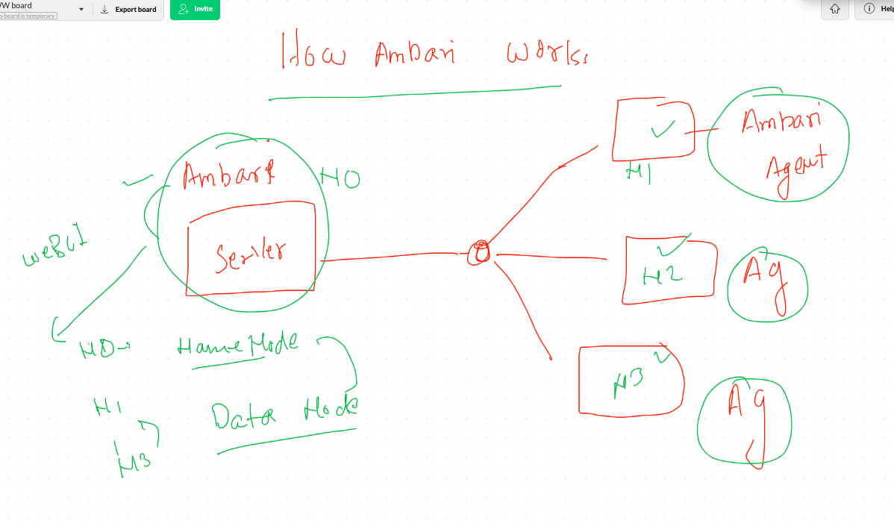

# apache ambari based HDP 2.6 setup

## Info about  setup


## ambari offering 


## How ambari works 



# to Setup ambari make sure NTP Client is running 

## Installing ambari-server and ambari-agent 

```
[root@ashunamenode yum.repos.d]# cd  /etc/yum.repos.d/
[root@ashunamenode yum.repos.d]# ls
CentOS-Base.repo  CentOS-Debuginfo.repo  CentOS-Sources.repo  CentOS-fasttrack.repo  epel.repo
CentOS-CR.repo    CentOS-Media.repo      CentOS-Vault.repo    epel-testing.repo
[root@ashunamenode yum.repos.d]# 
[root@ashunamenode yum.repos.d]# 
[root@ashunamenode yum.repos.d]# wget  http://public-repo-1.hortonworks.com/ambari/centos7/2.x/updates/2.6.2.2/ambari.repo
--2020-09-14 06:05:21--  http://public-repo-1.hortonworks.com/ambari/centos7/2.x/updates/2.6.2.2/ambari.repo
Resolving public-repo-1.hortonworks.com (public-repo-1.hortonworks.com)... 99.84.181.101, 99.84.181.62, 99.84.181.69, ...
Connecting to public-repo-1.hortonworks.com (public-repo-1.hortonworks.com)|99.84.181.101|:80... connected.
HTTP request sent, awaiting response... 200 OK
Length: 304 [binary/octet-stream]
Saving to: 'ambari.repo'

100%[==========================================================>] 304         --.-K/s   in 0s      

2020-09-14 06:05:21 (51.1 MB/s) - 'ambari.repo' saved [304/304]

[root@ashunamenode yum.repos.d]# ls
CentOS-Base.repo       CentOS-Media.repo    CentOS-fasttrack.repo  epel.repo
CentOS-CR.repo         CentOS-Sources.repo  ambari.repo
CentOS-Debuginfo.repo  CentOS-Vault.repo    epel-testing.repo


```

## Installing ambari agent on all the system 

```
[root@ashunamenode yum.repos.d]# yum  install ambari-agent 
Failed to set locale, defaulting to C
Loaded plugins: fastestmirror
Loading mirror speeds from cached hostfile
 * base: d36uatko69830t.cloudfront.net
 * epel: dl.fedoraproject.org
 * extras: d36uatko69830t.cloudfront.net
 * updates: d36uatko69830t.cloudfront.net
ambari-2.6.2.2                                                               | 2.9 kB  00:00:00     
ambari-2.6.2.2/primary_db                                                    | 8.7 kB  00:00:00     
Resolving Dependencies
--> Running transaction check
---> Package ambari-agent.x86_64 0:2.6.2.2-1 will be installed
--> Finished Dependency Resolution

Dependencies Resolved

====================================================================================================
 Package                  Arch               Version               Repository                  Size
====================================================================================================
Installing:
 ambari-agent             x86_64             2.6.2.2-1             ambari-2.6.2.2              90 M

Transaction Summary

```

## amabri server on single machine only 

```
[root@ashunamenode ~]# yum  install ambari-server   -y
Failed to set locale, defaulting to C
Loaded plugins: fastestmirror
Loading mirror speeds from cached hostfile
 * base: d36uatko69830t.cloudfront.net
 * epel: dl.fedoraproject.org
 * extras: d36uatko69830t.cloudfront.net
 * updates: d36uatko69830t.cloudfront.net
Resolving Dependencies
--> Running transaction check
---> Package ambari-server.x86_64 0:2.6.2.2-1 will be installed
--> Processing Dependency: postgresql-server >= 8.1 for pa

```

## ambari-server setup process

```
[root@ashunamenode ~]# ambari-server  setup  
Using python  /usr/bin/python
Setup ambari-server
Checking SELinux...
SELinux status is 'disabled'
Customize user account for ambari-server daemon [y/n] (n)? 
Adjusting ambari-server permissions and ownership...
Checking firewall status...
Checking JDK...
[1] Oracle JDK 1.8 + Java Cryptography Extension (JCE) Policy Files 8
[2] Oracle JDK 1.7 + Java Cryptography Extension (JCE) Policy Files 7
[3] Custom JDK


```

## start ambari-server

```
[root@ashunamenode ~]# ambari-server  start
Using python  /usr/bin/python
Starting ambari-server
Ambari Server running with administrator privileges.
Organizing resource files at /var/lib/ambari-server/resources...
Ambari database consistency check started...
Server PID at: /var/run/ambari-server/ambari-server.pid
Server out at: /var/log/ambari-server/ambari-server.out
Server log at: /var/log/ambari-server/ambari-server.log
Waiting for server start..........................
Server started listening on 8080

DB configs consistency check: no errors and warnings were found.
Ambari Server 'start' completed successfully.
[root@ashunamenode ~]# 
[root@ashunamenode ~]# 
[root@ashunamenode ~]# ambari-server  status
Using python  /usr/bin/python
Ambari-server status
Ambari Server running
Found Ambari Server PID: 3985 at: /var/run/ambari-server/ambari-server.pid

```

## In all the machine you have to configure ambari-agent and start its service 

```
 140  cd  /etc/ambari-agent/
  141  ls
  142  cd  conf/
  143  ls
  144  vim ambari-agent.ini 

# Licensed to the Apache Software Foundation (ASF) under one or more
# contributor license agreements.  See the NOTICE file distributed with
# this work for additional information regarding copyright ownership.
# The ASF licenses this file to You under the Apache License, Version 2.0
# (the "License"); you may not use this file except in compliance with
# the License.  You may obtain a copy of the License at
#
#     http://www.apache.org/licenses/LICENSE-2.0
#
# Unless required by applicable law or agreed to in writing, software
# distributed under the License is distributed on an "AS IS" BASIS,
# WITHOUT WARRANTIES OR CONDITIONS OF ANY KIND, either express or implied.
# See the License for the specific

[server]
hostname=ashunamenode.hadoop.com # here we
url_port=8440


```

## start ambari agent 

```
[root@ashunamenode conf]# ambari-agent   start
Verifying Python version compatibility...
Using python  /usr/bin/python
Checking for previously running Ambari Agent...
Checking ambari-common dir...
Starting ambari-agent
Verifying ambari-agent process status...
Ambari Agent successfully started
Agent PID at: /run/ambari-agent/ambari-agent.pid
Agent out at: /var/log/ambari-agent/ambari-agent.out
Agent log at: /var/log/ambari-agent/ambari-agent.log

---
[root@ashunamenode conf]# ambari-agent   status
Found ambari-agent PID: 4178
ambari-agent running.
Agent PID at: /run/ambari-agent/ambari-agent.pid
Agent out at: /var/log/ambari-agent/ambari-agent.out
Agent log at: /var/log/ambari-agent/ambari-agent.log

```
