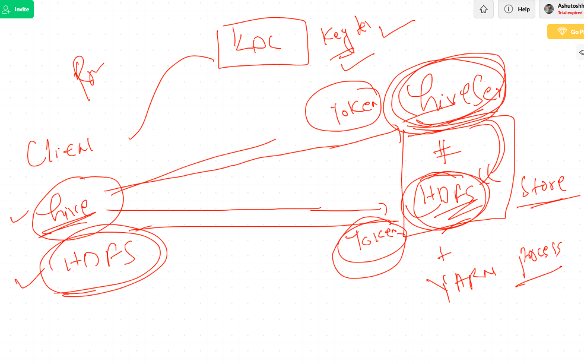
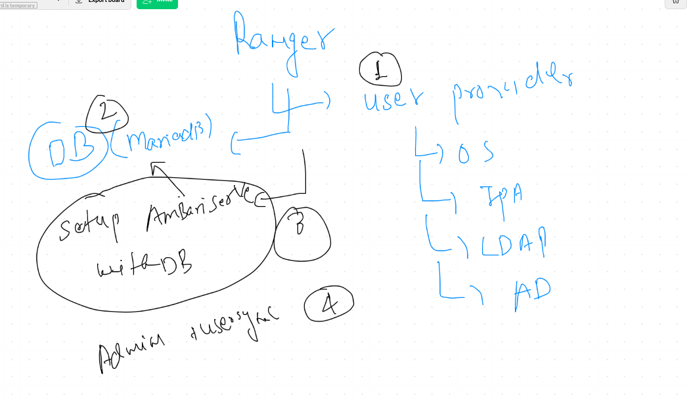
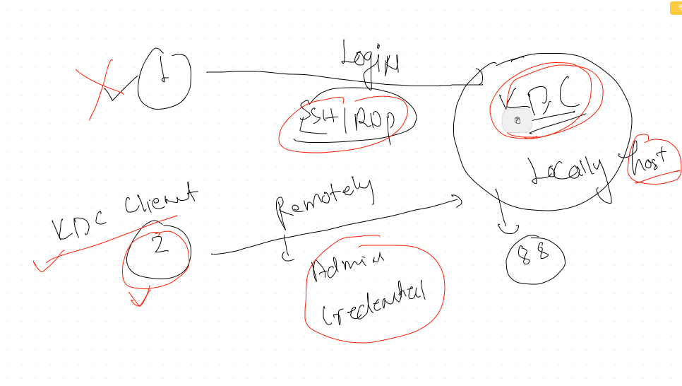

# Troubleshooting 

# Security troubleshooting 

## Cryptographic approach in kerberos 


## KDC with HDFS and Hive



## KDC ticket validation / generation  commands

```
[root@ip-172-31-73-56 hdfs]# kinit  admin/admin@EC2.INTERNA
kinit: Cannot find KDC for realm "EC2.INTERNA" while getting initial credentials
[root@ip-172-31-73-56 hdfs]# kinit  admin/admin@EC2.INTERNAL
Password for admin/admin@EC2.INTERNAL: 
[root@ip-172-31-73-56 hdfs]# 
[root@ip-172-31-73-56 hdfs]# klist 
Ticket cache: FILE:/tmp/krb5cc_0
Default principal: admin/admin@EC2.INTERNAL

Valid starting     Expires            Service principal
09/17/20 01:25:58  09/18/20 01:25:58  krbtgt/EC2.INTERNAL@EC2.INTERNAL
[root@ip-172-31-73-56 hdfs]# kdestroy 
[root@ip-172-31-73-56 hdfs]# klist 
klist: No credentials cache found (filename: /tmp/krb5cc_0)

```

## authencate with Hive principal as a single session 

```
[hive@ip-172-31-70-135 ~]$ kadmin -p  admin/admin@EC2.INTERNAL
Couldn't open log file /var/log/kadmind.log: Permission denied
Authenticating as principal admin/admin@EC2.INTERNAL with password.
Password for admin/admin@EC2.INTERNAL: 
kadmin:  listprincs 
HTTP/ip-172-31-68-237.ec2.internal@EC2.INTERNAL
HTTP/ip-172-31-70-135.ec2.internal@EC2.INTERNAL
HTTP/ip-172-31-73-56.ec2.internal@EC2.INTERNAL
HTTP/ip-172-31-79-94.ec2.internal@EC2.INTERNAL
K/M@EC2.INTERNAL
activity_analyzer/ip-172-31-68-237.ec2.internal@EC2.INTERNAL
activity_explorer/ip-172-31-68-237.ec2.internal@EC2.INTERNAL
admin/admin@EC2.INTERNAL
ambari-qa-myclusterrr@EC2.INTERNAL
ambari-server-myclusterrr@EC2.INTERNAL
amshbase/ip-172-31-73-56.ec2.internal@EC2.INTERNAL
amszk/ip-172-31-73-56.ec2.internal@EC2.INTERNAL
dn/ip-172-31-68-237.ec2.internal@EC2.INTERNAL
dn/ip-172-31-73-56.ec2.internal@EC2.INTERNAL
hbase-myclusterrr@EC2.INTERNAL
hbase/ip-172-31-68-237.ec2.internal@EC2.INTERNAL
hbase/ip-172-31-73-56.ec2.internal@EC2.INTERNAL
hdfs-myclusterrr@EC2.INTERNAL
hive/ip-172-31-68-237.ec2.internal@EC2.INTERNAL
hive/ip-172-31-70-135.ec2.internal@EC2.INTERNAL
hive/ip-172-31-73-56.ec2.internal@EC2.INTERNAL

```

## Now try checkin with Keytabs auth 

```
[hive@ip-172-31-70-135 ~]$ klist 
klist: No credentials cache found (filename: /tmp/krb5cc_1001)

```

## match your host and list your principal as above then use it 

```
[hive@ip-172-31-70-135 ~]$ hostname
ip-172-31-70-135.ec2.internal
[hive@ip-172-31-70-135 ~]$  kinit -V -k -t  /etc/security/keytabs/hive.service.keytab  hive/ip-172-31-70-135.ec2.internal@EC2.INTERNAL
Using default cache: /tmp/krb5cc_1001
Using principal: hive/ip-172-31-70-135.ec2.internal@EC2.INTERNAL
Using keytab: /etc/security/keytabs/hive.service.keytab
Authenticated to Kerberos v5

[hive@ip-172-31-70-135 ~]$ 
[hive@ip-172-31-70-135 ~]$ 
[hive@ip-172-31-70-135 ~]$ klist 
Ticket cache: FILE:/tmp/krb5cc_1001
Default principal: hive/ip-172-31-70-135.ec2.internal@EC2.INTERNAL

Valid starting       Expires              Service principal
09/17/2020 02:32:10  09/18/2020 02:32:09  krbtgt/EC2.INTERNAL@EC2.INTERNAL

```

### Note make sure you don't have duplicate session otherwise it will not work 


## Logs of Kerberos 

```
[root@ip-172-31-70-135 log]# ls
ambari-agent              boot.log-20200916  grubby              hive-hcatalog     mariadb            spooler             yum.log-20200915
ambari-infra-solr-client  btmp               grubby_prune_debug  hive2             messages           spooler-20200915    zookeeper
ambari-metrics-monitor    btmp-20200915      hadoop              hst               messages-20200915  tallylog
ambari-server             cloud-init.log     hadoop-hdfs         kadmind.log       ntpstats           tuned
anaconda                  cron               hadoop-mapreduce    krb5kdc.log       ppp                webhcat
audit                     cron-20200915      hadoop-yarn         lastlog           ranger             wpa_supplicant.log
boot.log                  dmesg              hbase               maillog           secure             wtmp
boot.log-20200915         dmesg.old          hive                maillog-20200915  secure-20200915    yum.log

```


## Apache Ranger. 

### an autherization service for HDP 


## Ranger setup Image 



## connection mariadb with JDBC 

```
[root@ip-172-31-70-135 jdk1.8.0_112]# ambari-server setup --jdbc-db=mysql --jdbc-driver=/usr/share/java/mysql-connector-java.jar

```


## After integration with Ranger or / kdc  order of HDP cluster service to start 


## to work with ranger we will be creating users on KDC/LDAP 

### connecting to KDC remotely 



## connecting to Remote KDC 

```
[root@ip-172-31-70-135 ~]# kadmin -p  "admin/admin@EC2.INTERNAL"
Authenticating as principal admin/admin@EC2.INTERNAL with password.
Password for admin/admin@EC2.INTERNAL: 
kadmin:  
kadmin:  

```

## adding user to KDC

```
kadmin:  addprinc  ashutoshh@EC2.INTERNAL
WARNING: no policy specified for ashutoshh@EC2.INTERNAL; defaulting to no policy
Enter password for principal "ashutoshh@EC2.INTERNAL": 
Re-enter password for principal "ashutoshh@EC2.INTERNAL": 
Principal "ashutoshh@EC2.INTERNAL" created.
kadmin:  
```

### checking created users

```
kadmin:  listprincs 
HTTP/ip-172-31-68-237.ec2.internal@EC2.INTERNAL
HTTP/ip-172-31-70-135.ec2.internal@EC2.INTERNAL
HTTP/ip-172-31-73-56.ec2.internal@EC2.INTERNAL
HTTP/ip-172-31-79-94.ec2.internal@EC2.INTERNAL
K/M@EC2.INTERNAL
activity_analyzer/ip-172-31-68-237.ec2.internal@EC2.INTERNAL
activity_explorer/ip-172-31-68-237.ec2.internal@EC2.INTERNAL
admin/admin@EC2.INTERNAL
ambari-qa-myclusterrr@EC2.INTERNAL
ambari-server-myclusterrr@EC2.INTERNAL
amshbase/ip-172-31-73-56.ec2.internal@EC2.INTERNAL
amszk/ip-172-31-73-56.ec2.internal@EC2.INTERNAL
arun@EC2.INTERNAL
ashis@EC2.INTERNAL
ashutoshh@EC2.INTERNAL
dinesh@EC2.INTERNAL
dipti@EC2.INTERNAL

```


## Login to user personal user

```
[root@ip-172-31-70-135 ~]# klist 
klist: No credentials cache found (filename: /tmp/krb5cc_0)
[root@ip-172-31-70-135 ~]# 
[root@ip-172-31-70-135 ~]# 
[root@ip-172-31-70-135 ~]# kinit   ashutoshh@EC2.INTERNAL
Password for ashutoshh@EC2.INTERNAL: 
[root@ip-172-31-70-135 ~]# klist 
Ticket cache: FILE:/tmp/krb5cc_0
Default principal: ashutoshh@EC2.INTERNAL

Valid starting     Expires            Service principal
09/17/20 03:27:33  09/18/20 03:27:32  krbtgt/EC2.INTERNAL@EC2.INTERNAL

```
  ```
  
