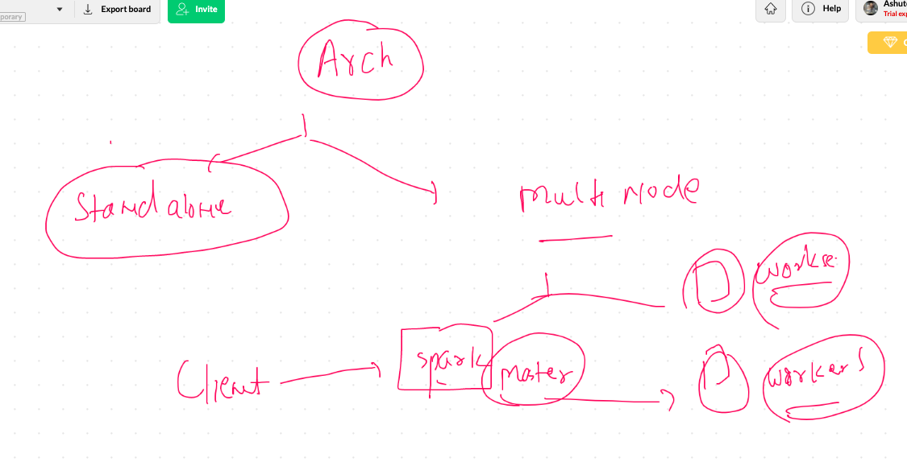

# Apache spark 

## Distributed IN memory processing superfast framework for Bigdata 


## More info 


## Admin points

## Downoading tar ball from apache spark 

```
wget http://apachemirror.wuchna.com/spark/spark-2.4.7/spark-2.4.7-bin-hadoop2.7.tgz
 tar xzvf spark-2.4.7-bin-hadoop2.7.tgz 
 
 ```
 ## moving spark to opt and do some env var configure 
 
 ```
 [root@ip-172-31-70-87 ~]# cd /opt/spark2/
[root@ip-172-31-70-87 spark2]# ls
LICENSE  R          RELEASE  conf  examples  kubernetes  python  yarn
NOTICE   README.md  bin      data  jars      licenses    sbin
[root@ip-172-31-70-87 spark2]# export  SPARK_HOME=/opt/spark2/
[root@ip-172-31-70-87 spark2]# export PATH=$PATH:$SPARK_HOME:$SPARK_HOME/bin:$SPARK_HOME/sbin

```

## staring spark master

```
[root@ip-172-31-70-87 spark2]# echo $SPARK_HOME
/opt/spark2/
[root@ip-172-31-70-87 spark2]# start-master.sh  
starting org.apache.spark.deploy.master.Master, logging to /opt/spark2//logs/spark-root-org.apache.spark.deploy.master.Master-1-ip-172-31-70-87.ec2.internal.out
[root@ip-172-31-70-87 spark2]# netstat -nlpt
Active Internet connections (only servers)
Proto Recv-Q Send-Q Local Address           Foreign Address         State       PID/Program name    
tcp        0      0 0.0.0.0:8670            0.0.0.0:*               LISTEN      2932/python         
tcp        0      0 0.0.0.0:22              0.0.0.0:*               LISTEN      1116/sshd           
tcp6       0      0 172.31.70.87:7077       :::*                    LISTEN      10872/java          
tcp6       0      0 :::8080                 :::*                    LISTEN      10872/java          
tcp6       0      0 :::22                   :::*                    LISTEN      1116/sshd    

```

### configure spark slave / worker 

```
 24  tar xvzf spark-2.4.7-bin-hadoop2.7.tgz 
   25  ls
   26  mv spark-2.4.7-bin-hadoop2.7  /opt/spark2/
   27  export  SPARK_HOME=/opt/spark2/
   28  export PATH=$PATH:$SPARK_HOME:$SPARK_HOME/bin:$SPARK_HOME/sbin
   29  echo $SPARK_HOME
   30  start-slave.sh   spark://ip-172-31-70-87.ec2.internal:7077
   
   ```
   
   
## spark connect




## spark variable persistent 

```
[root@ip-172-31-70-87 ~]# cat  /root/.bashrc 
# .bashrc

# User specific aliases and functions

alias rm='rm -i'
alias cp='cp -i'
alias mv='mv -i'

# Source global definitions
if [ -f /etc/bashrc ]; then
	. /etc/bashrc
fi

export  SPARK_HOME=/opt/spark2/
export PATH=$PATH:$SPARK_HOME:$SPARK_HOME/bin:$SPARK_HOME/sbin

```

## starting with scala using spark-shell 

```
cd /opt/spark2
[root@ip-172-31-70-87 spark2]# ./bin/spark-shell 
20/09/17 07:02:28 WARN NativeCodeLoader: Unable to load native-hadoop library for your platform... using builtin-java classes where applicable
Using Spark's default log4j profile: org/apache/spark/log4j-defaults.properties
Setting default log level to "WARN".
To adjust logging level use sc.setLogLevel(newLevel). For SparkR, use setLogLevel(newLevel).
20/09/17 07:02:40 WARN Utils: Service 'SparkUI' could not bind on port 4040. Attempting port 4041.
20/09/17 07:02:40 WARN Utils: Service 'SparkUI' could not bind on port 4041. Attempting port 4042.
20/09/17 07:02:40 WARN Utils: Service 'SparkUI' could not bind on port 4042. Attempting port 4043.
Spark context Web UI available at http://ip-172-31-70-87.ec2.internal:4043
Spark context available as 'sc' (master = local[*], app id = local-1600340561060).
Spark session available as 'spark'.
Welcome to
      ____              __
     / __/__  ___ _____/ /__
    _\ \/ _ \/ _ `/ __/  '_/
   /___/ .__/\_,_/_/ /_/\_\   version 2.4.7
      /_/
         
Using Scala version 2.11.12 (OpenJDK 64-Bit Server VM, Java 1.8.0_262)
Type in expressions to have them evaluated.
Type :help for more information.


```


## connecting spark using python 

```
[root@ip-172-31-70-87 spark2]# ./bin/pyspark 
Python 2.7.5 (default, Apr  2 2020, 13:16:51) 
[GCC 4.8.5 20150623 (Red Hat 4.8.5-39)] on linux2
Type "help", "copyright", "credits" or "license" for more information.
20/09/17 07:04:20 WARN NativeCodeLoader: Unable to load native-hadoop library for your platform... using builtin-java classes where applicable
Using Spark's default log4j profile: org/apache/spark/log4j-defaults.properties
Setting default log level to "WARN".
To adjust logging level use sc.setLogLevel(newLevel). For SparkR, use setLogLevel(newLevel).
Welcome to
      ____              __
     / __/__  ___ _____/ /__
    _\ \/ _ \/ _ `/ __/  '_/
   /__ / .__/\_,_/_/ /_/\_\   version 2.4.7
      /_/

Using Python version 2.7.5 (default, Apr  2 2020 13:16:51)
SparkSession available as 'spark'.

```

