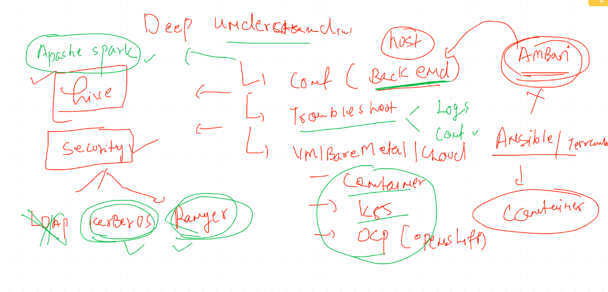

# HDP  Backend Understanding 

# agenda sharing 



## checking rpm packages installed by ambari 

```
[root@ashumaster ~]# rpm  -qa  ambari* 
ambari-agent-2.6.2.2-1.x86_64
ambari-metrics-hadoop-sink-2.6.2.2-1.x86_64
ambari-server-2.6.2.2-1.x86_64
ambari-infra-solr-client-2.6.2.2-1.noarch
ambari-metrics-monitor-2.6.2.2-1.x86_64
[root@ashumaster ~]# rpm  -qa  |  grep -i hadoop
hadoop_2_6_5_1175_1-yarn-2.7.3.2.6.5.1175-1.x86_64
hadoop_2_6_5_1175_1-client-2.7.3.2.6.5.1175-1.x86_64
ambari-metrics-hadoop-sink-2.6.2.2-1.x86_64
hadoop_2_6_5_1175_1-2.7.3.2.6.5.1175-1.x86_64
hadoop_2_6_5_1175_1-mapreduce-2.7.3.2.6.5.1175-1.x86_64
hadoop_2_6_5_1175_1-hdfs-2.7.3.2.6.5.1175-1.x86_64
hadoop_2_6_5_1175_1-libhdfs-2.7.3.2.6.5.1175-1.x86_64
[root@ashumaster ~]# rpm  -ql hadoop_2_6_5_1175_1-hdfs
/usr/hdp/2.6.5.1175-1/etc/hadoop/conf.empty/hdfs-site.xml
/usr/hdp/2.6.5.1175-1/etc/security/limits.d/hdfs.conf
/usr/hdp/2.6.5.1175-1/hadoop-hdfs
/usr/hdp/2.6.5.1175-1/hadoop-hdfs/bin
/usr/hdp/2.6.5.1175-1/hadoop-hdfs/bin/hdfs

```
## checking HDFS backend done by ambari agent 

```
[root@ashumaster ~]# cd  /etc/hadoop/
2.6.5.1175-1/ conf/         conf.backup/  
[root@ashumaster ~]# cd  /etc/hadoop/
[root@ashumaster hadoop]# ls
2.6.5.1175-1  conf  conf.backup
[root@ashumaster hadoop]# cd  2.6.5.1175-1/
[root@ashumaster 2.6.5.1175-1]# ls
0
[root@ashumaster 2.6.5.1175-1]# cd  0/
[root@ashumaster 0]# ls
capacity-scheduler.xml      kms-acls.xml                ssl-client.xml.example
commons-logging.properties  kms-env.sh                  ssl-server.xml
configuration.xsl           kms-log4j.properties        ssl-server.xml.example
container-executor.cfg      kms-site.xml                task-log4j.properties
core-site.xml               log4j.properties            taskcontroller.cfg
dfs.exclude                 mapred-env.cmd              topology_mappings.data
hadoop-env.cmd              mapred-env.sh               topology_script.py
hadoop-env.sh               mapred-queues.xml.template  yarn-env.cmd
hadoop-metrics.properties   mapred-site.xml             yarn-env.sh
hadoop-metrics2.properties  mapred-site.xml.template    yarn-site.xml
hadoop-policy.xml           secure                      yarn.exclude
hdfs-site.xml               slaves
health_check                ssl-client.xml

```

