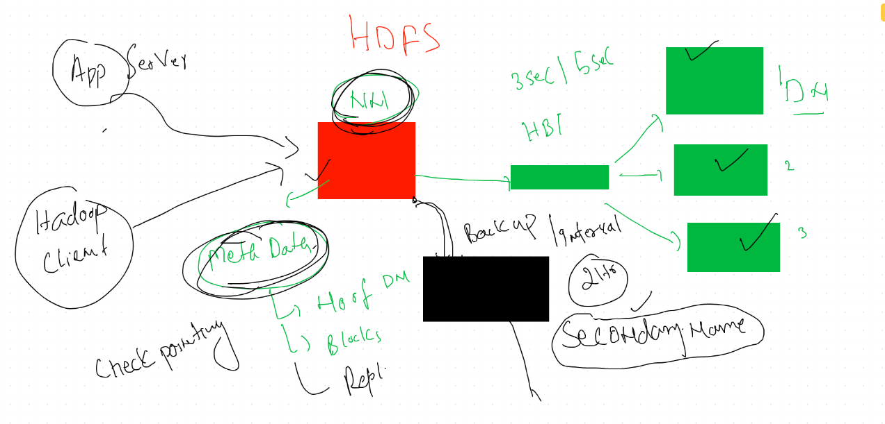

#  Day 2 
# Sec NameNode  concept 



# Map Reduce 


# YARN 


# Hadoop Client 

## connect from client machine using hdfs user

```
[root@ashumaster ~]# su  - hdfs  
Last login: Tue Sep 15 02:33:40 EDT 2020
[hdfs@ashumaster ~]$ 
[hdfs@ashumaster ~]$ 
[hdfs@ashumaster ~]$ whoami
hdfs

```

##  check directory structure

```
[hdfs@ashumaster ~]$ hdfs   dfs   -ls    /
Found 7 items
drwxrwxrwx   - yarn   hadoop          0 2020-09-15 02:36 /app-logs
drwxr-xr-x   - yarn   hadoop          0 2020-09-15 02:05 /ats
drwxr-xr-x   - hdfs   hdfs            0 2020-09-15 02:05 /hdp
drwxr-xr-x   - mapred hdfs            0 2020-09-15 02:05 /mapred
drwxrwxrwx   - mapred hadoop          0 2020-09-15 02:23 /mr-history
drwxrwxrwx   - hdfs   hdfs            0 2020-09-15 02:05 /tmp
drwxr-xr-x   - hdfs   hdfs            0 2020-09-15 02:05 /user
[hdfs@ashumaster ~]$ hdfs   dfs   -ls    /hdp 
Found 1 items
drwxr-xr-x   - hdfs hdfs          0 2020-09-15 02:05 /hdp/apps
[hdfs@ashumaster ~]$ 

```

## creating directory 

```
 4  hdfs   dfs   -mkdir   /ashutoshhdata 
    5  hdfs   dfs   -ls    /

```

## taking help 

```
[hdfs@ashumaster ~]$ hdfs  dfs  
Usage: hadoop fs [generic options]
	[-appendToFile <localsrc> ... <dst>]
	[-cat [-ignoreCrc] <src> ...]
	[-checksum <src> ...]
	[-chgrp [-R] GROUP PATH...]
	[-chmod [-R] <MODE[,MODE]... | OCTALMODE> PATH...]
	[-chown [-R] [OWNER][:[GROUP]] PATH...]
	[-copyFromLocal [-f] [-p] [-l] <localsrc> ... <dst>]
	[-copyToLocal [-p] [-ignoreCrc] [-crc] <src> ... <localdst>]
	[-count [-q] [-h] [-v] [-t [<storage type>]] [-u] <path> ...]
	[-cp [-f] [-p | -p[topax]] <src> ... <dst>]
	[-createSnapshot <snapshotDir> [<snapshotName>]]
	[-deleteSnapshot <snapshotDir> <snapshotName>]
	[-df [-h] [<path> ...]]
	[-du [-s] [-h] <path> ...]
	[-expunge]
	[-find <path> ... <expression> ...]
	[-get [-p] [-ignoreCrc] [-crc] <src> ... <local
  
  ```
  
  ## More HDFS commands
  
  ```
    28  hdfs  dfs  -copyFromLocal   ashudata.txt    /ashutoshhdata
   29  hdfs  dfs  -rm  /ashutoshhdata/ashudata.txt
   30  hdfs  dfs  -copyFromLocal   ashudata.txt    /ashutoshhdata
   31  history 
   32  hdfs  dfs  -cat  /ashutoshhdata/ashudata.txt
   ```
   
## safemode 

```
 35  hdfs  dfsadmin  -report 
   36  hdfs  dfsadmin  -safemode  enter  
   37  hdfs  dfs  -ls   /
   38  hdfs  dfs  -ls   /ashutoshh
   39  hdfs  dfs  -ls   /ashutoshhdata
   40  hdfs  dfs  -cat  /ashutoshhdata/ashudata.txt
   41  hdfs   dfs  -ls   /
   42  hdfs   dfs  -mkdir    /helloashu
   43  hdfs  dfsadmin  -safemode  leave 
   44  hdfs   dfs  -mkdir    /helloashu
   45  hdfs  dfsadmin  -report 

```

# HA in Namenode : 

## concept 

## we need 5 VMS 

<ol>
	<li> current name node </li>
	<li> additional node for stand by </li>
	<li> 3 journal nodes atlease </li>
</ol>

## pic 


## Go to service tab in ambari and click on namenode HA then follow the steps 

## Put current namenode as in SafeMode 

```
[hdfs@ashumaster ~]$ hdfs dfsadmin -safemode enter 
Safe mode is ON

```
## just to cross check 

```
[hdfs@ashumaster ~]$ hdfs dfsadmin  -report 
Safe mode is ON
Configured Capacity: 543938314240 (506.58 GB)
Present Capacity: 513680487989 (478.40 GB)
DFS Remaining: 490488451072 (456.80 GB)
DFS Used: 23192036917 (21.60 GB)
DFS Used%: 4.51%
Under replicated blocks: 0
Blocks with corrupt replicas: 0
Missing blocks: 0

```

## Now take backup that is check pointing 

```
[hdfs@ashumaster ~]$ hdfs dfsadmin -saveNamespace
Save namespace successful

```

## after following web ui now initialize the journal nodes

```
hdfs namenode -initializeSharedEdits
```

## configure failover tech in current master node 

```
hdfs zkfc -formatZK
```

## stop secondary namenode and configure as additional namenode 

```
hdfs namenode -bootstrapStandby
```

## now click the final from web UI 

# Now evalution of HA

```
[hdfs@ashumaster ~]$ hdfs   haadmin   -getServiceState nn1
active
[hdfs@ashumaster ~]$ hdfs   haadmin   -getServiceState nn2
standby
[hdfs@ashumaster ~]$ 
[hdfs@ashumaster ~]$ 
[hdfs@ashumaster ~]$ 
[hdfs@ashumaster ~]$ hdfs  haadmin  -failover  nn1  nn2
Failover to NameNode at madhumaster.hadoop.com/172.31.72.240:8020 successful
[hdfs@ashumaster ~]$ hdfs   haadmin   -getServiceState nn1
standby
[hdfs@ashumaster ~]$ hdfs   haadmin   -getServiceState nn2
active
[hdfs@ashumaster ~]$ hdfs  dfs  -ls  /
Found 22 items
drwxrwxrwx   - yarn   hadoop          0 2020-09-15 02:36 /app-logs
drwxr-xr-x   - hdfs   hdfs            0 2020-09-15 03:09 /ashisData
drwxr-xr-x   - hdfs   hdfs            0 2020-09-15 03:10 /ashutoshhdata
drwxr-xr-x   - yarn   hadoop          0 2020-09-15 02:05 /ats
drwxr-xr-x   - hdfs   hdfs            0 2020-09-15 03:12 /banudata
drwxr-xr-x   - hdfs   hdfs            0 2020-09-15 03:09 /deepakdata
drwxr-xr-x   - hdfs   hdfs            0 2020-09-15 03:09 /dinesh
drwxr-xr-x   - hdfs   hdfs            0 2020-09-15 03:18 /diptidata
-rw-r--r--   3 hdfs   hdfs           33 2020-09-15 03:20 /girish
drwxr-xr-x   - hdfs   hdfs            0 2020-09-15 03:19 /girishdata
drwxr-xr-x   - hdfs   hdfs            0 2020-09-15 02:05 /hdp
drwxr-xr-x   - hdfs   hdfs            0 2020-09-15 03:32 /helloashu
drwxr-xr-x   - hdfs   hdfs            0 2020-09-15 03:32 /hellosrini
drwxr-xr-x   - hdfs   hdfs            0 2020-09-15 03:05 /kdpdata
drwxr-xr-x   - hdfs   hdfs            0 2020-09-15 03:10 /madhudata
drwxr-xr-x   - mapred hdfs            0 2020-09-15 02:05 /mapred
drwxrwxrwx   - mapred hadoop          0 2020-09-15 02:23 /mr-history
drwxr-xr-x   - hdfs   hdfs            0 2020-09-15 03:09 /pradeepdata
drwxr-xr-x   - hdfs   hdfs            0 2020-09-15 03:09 /rohitkdata
drwxr-xr-x   - hdfs   hdfs            0 2020-09-15 03:09 /srinidata
drwxrwxrwx   - hdfs   hdfs            0 2020-09-15 02:05 /tmp
drwxr-xr-x   - hdfs   hdfs            0 2020-09-15 03:09 /user

```

