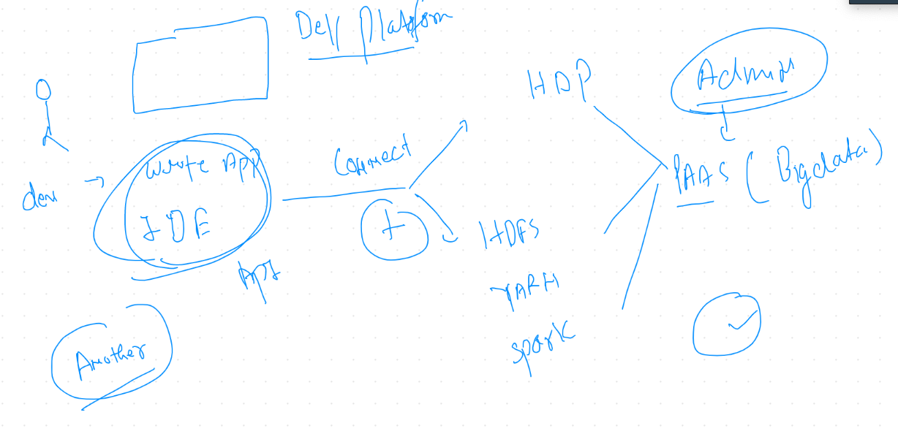
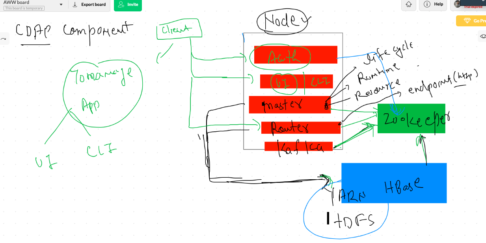

# Cdap for application developers 




## some basic info about CDAP 


## CDAP arch / components 



## Installation options 


## Install using ambari 

### Existing hadoop cluster 

### HDFS 
### YARN , Hbase , Zookeeper 

## Presteps 

```
[hdfs@ip-172-31-56-63 ~]$ hdfs dfs  -ls  /user
Found 6 items
drwxrwx---   - ambari-qa hdfs          0 2020-09-18 00:04 /user/ambari-qa
drwxr-xr-x   - hbase     hdfs          0 2020-09-18 00:14 /user/hbase
drwxr-xr-x   - hcat      hdfs          0 2020-09-18 00:03 /user/hcat
drwxr-xr-x   - hive      hdfs          0 2020-09-18 00:04 /user/hive
drwxrwxr-x   - livy      hdfs          0 2020-09-18 00:03 /user/livy
drwxrwxr-x   - spark     hdfs          0 2020-09-18 00:03 /user/spark
[hdfs@ip-172-31-56-63 ~]$ hdfs dfs  -mkdir  /user/yarn
[hdfs@ip-172-31-56-63 ~]$ hdfs dfs  -mkdir  /user/cdap
[hdfs@ip-172-31-56-63 ~]$ hdfs dfs  -ls  /user
Found 8 items
drwxrwx---   - ambari-qa hdfs          0 2020-09-18 00:04 /user/ambari-qa
drwxr-xr-x   - hdfs      hdfs          0 2020-09-18 02:53 /user/cdap
drwxr-xr-x   - hbase     hdfs          0 2020-09-18 00:14 /user/hbase
drwxr-xr-x   - hcat      hdfs          0 2020-09-18 00:03 /user/hcat
drwxr-xr-x   - hive      hdfs          0 2020-09-18 00:04 /user/hive
drwxrwxr-x   - livy      hdfs          0 2020-09-18 00:03 /user/livy
drwxrwxr-x   - spark     hdfs          0 2020-09-18 00:03 /user/spark
drwxr-xr-x   - hdfs      hdfs          0 2020-09-18 02:53 /user/yarn
[hdfs@ip-172-31-56-63 ~]$ hdfs dfs  -chown yarn:yarn   /user/yarn
[hdfs@ip-172-31-56-63 ~]$ hdfs dfs  -chown cdap:cdap   /user/cdap
[hdfs@ip-172-31-56-63 ~]$ hdfs dfs  -ls  /user
Found 8 items
drwxrwx---   - ambari-qa hdfs          0 2020-09-18 00:04 /user/ambari-qa
drwxr-xr-x   - cdap      cdap          0 2020-09-18 02:53 /user/cdap
drwxr-xr-x   - hbase     hdfs          0 2020-09-18 00:14 /user/hbase
drwxr-xr-x   - hcat      hdfs          0 2020-09-18 00:03 /user/hcat
drwxr-xr-x   - hive      hdfs          0 2020-09-18 00:04 /user/hive
drwxrwxr-x   - livy      hdfs          0 2020-09-18 00:03 /user/livy
drwxrwxr-x   - spark     hdfs          0 2020-09-18 00:03 /user/spark
drwxr-xr-x   - yarn      yarn          0 2020-09-18 02:53 /user/yarn

```

## installing cdap-ambari package so that ambari can browser cdap service

```
 55  cd  /etc/yum.repos.d/
   56  ls
   57  vim  cdap.repo
   58  rpm --import http://repository.cask.co/centos/6/x86_64/cdap/4.2/pubkey.gpg
   59   yum install -y cdap-ambari-service
   60  ambari-server  restart

```

## yum repo file

```
[root@ip-172-31-56-63 yum.repos.d]# cat cdap.repo 
[cask]
name=Cask Packages
baseurl=https://repository.cask.co/centos/6/x86_64/cdap/4.2
enabled=1
gpgcheck=1

```

## you can use this official link for the same 

[cask link] (https://docs.cask.co/cdap/4.2.0/en/admin-manual/installation/ambari.html#admin-installation-ambari)
