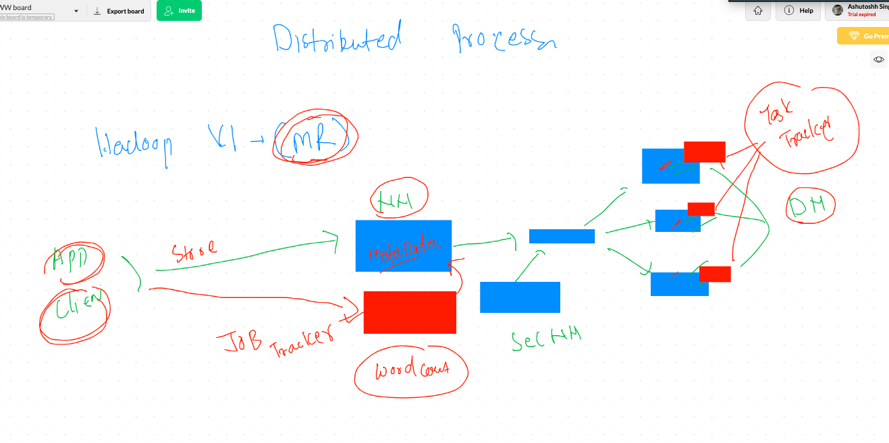

#  Day 2 
# Sec NameNode  concept 


# Map Reduce 



# YARN 


# Hadoop Client 

## connect from client machine using hdfs user

```
[root@ashumaster ~]# su  - hdfs  
Last login: Tue Sep 15 02:33:40 EDT 2020
[hdfs@ashumaster ~]$ 
[hdfs@ashumaster ~]$ 
[hdfs@ashumaster ~]$ whoami
hdfs

```

##  check directory structure

```
[hdfs@ashumaster ~]$ hdfs   dfs   -ls    /
Found 7 items
drwxrwxrwx   - yarn   hadoop          0 2020-09-15 02:36 /app-logs
drwxr-xr-x   - yarn   hadoop          0 2020-09-15 02:05 /ats
drwxr-xr-x   - hdfs   hdfs            0 2020-09-15 02:05 /hdp
drwxr-xr-x   - mapred hdfs            0 2020-09-15 02:05 /mapred
drwxrwxrwx   - mapred hadoop          0 2020-09-15 02:23 /mr-history
drwxrwxrwx   - hdfs   hdfs            0 2020-09-15 02:05 /tmp
drwxr-xr-x   - hdfs   hdfs            0 2020-09-15 02:05 /user
[hdfs@ashumaster ~]$ hdfs   dfs   -ls    /hdp 
Found 1 items
drwxr-xr-x   - hdfs hdfs          0 2020-09-15 02:05 /hdp/apps
[hdfs@ashumaster ~]$ 

```

## creating directory 

```
 4  hdfs   dfs   -mkdir   /ashutoshhdata 
    5  hdfs   dfs   -ls    /

```

## taking help 

```
[hdfs@ashumaster ~]$ hdfs  dfs  
Usage: hadoop fs [generic options]
	[-appendToFile <localsrc> ... <dst>]
	[-cat [-ignoreCrc] <src> ...]
	[-checksum <src> ...]
	[-chgrp [-R] GROUP PATH...]
	[-chmod [-R] <MODE[,MODE]... | OCTALMODE> PATH...]
	[-chown [-R] [OWNER][:[GROUP]] PATH...]
	[-copyFromLocal [-f] [-p] [-l] <localsrc> ... <dst>]
	[-copyToLocal [-p] [-ignoreCrc] [-crc] <src> ... <localdst>]
	[-count [-q] [-h] [-v] [-t [<storage type>]] [-u] <path> ...]
	[-cp [-f] [-p | -p[topax]] <src> ... <dst>]
	[-createSnapshot <snapshotDir> [<snapshotName>]]
	[-deleteSnapshot <snapshotDir> <snapshotName>]
	[-df [-h] [<path> ...]]
	[-du [-s] [-h] <path> ...]
	[-expunge]
	[-find <path> ... <expression> ...]
	[-get [-p] [-ignoreCrc] [-crc] <src> ... <local
  
  ```
  
  ## More HDFS commands
  
  ```
    28  hdfs  dfs  -copyFromLocal   ashudata.txt    /ashutoshhdata
   29  hdfs  dfs  -rm  /ashutoshhdata/ashudata.txt
   30  hdfs  dfs  -copyFromLocal   ashudata.txt    /ashutoshhdata
   31  history 
   32  hdfs  dfs  -cat  /ashutoshhdata/ashudata.txt
   ```
   
