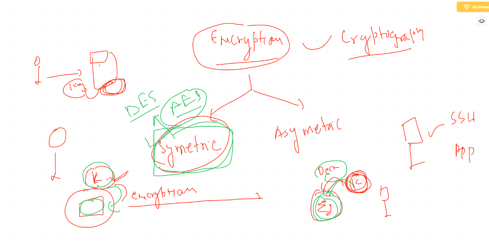

# Troubleshooting 

# Security troubleshooting 

## Cryptographic approach in kerberos 



## KDC with HDFS and Hive


## KDC ticket validation / generation  commands

```
[root@ip-172-31-73-56 hdfs]# kinit  admin/admin@EC2.INTERNA
kinit: Cannot find KDC for realm "EC2.INTERNA" while getting initial credentials
[root@ip-172-31-73-56 hdfs]# kinit  admin/admin@EC2.INTERNAL
Password for admin/admin@EC2.INTERNAL: 
[root@ip-172-31-73-56 hdfs]# 
[root@ip-172-31-73-56 hdfs]# klist 
Ticket cache: FILE:/tmp/krb5cc_0
Default principal: admin/admin@EC2.INTERNAL

Valid starting     Expires            Service principal
09/17/20 01:25:58  09/18/20 01:25:58  krbtgt/EC2.INTERNAL@EC2.INTERNAL
[root@ip-172-31-73-56 hdfs]# kdestroy 
[root@ip-172-31-73-56 hdfs]# klist 
klist: No credentials cache found (filename: /tmp/krb5cc_0)

```


